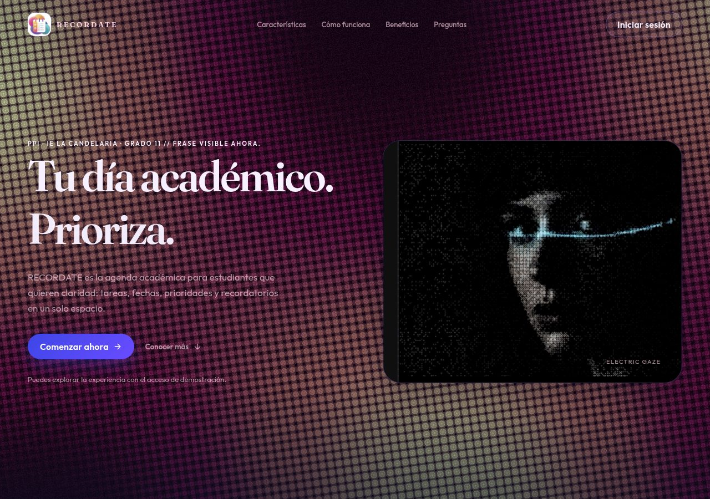
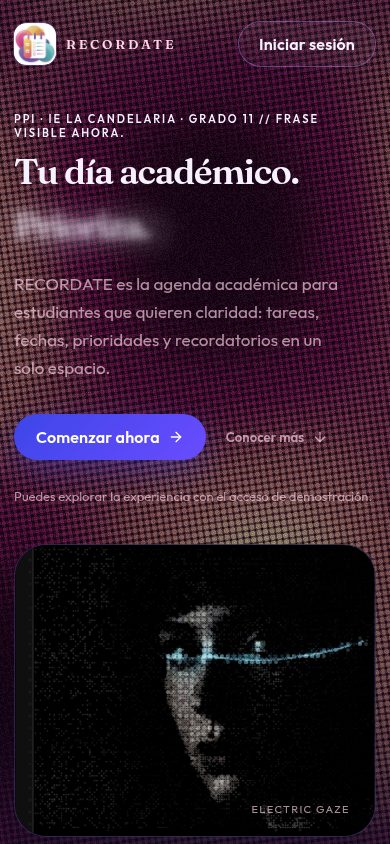
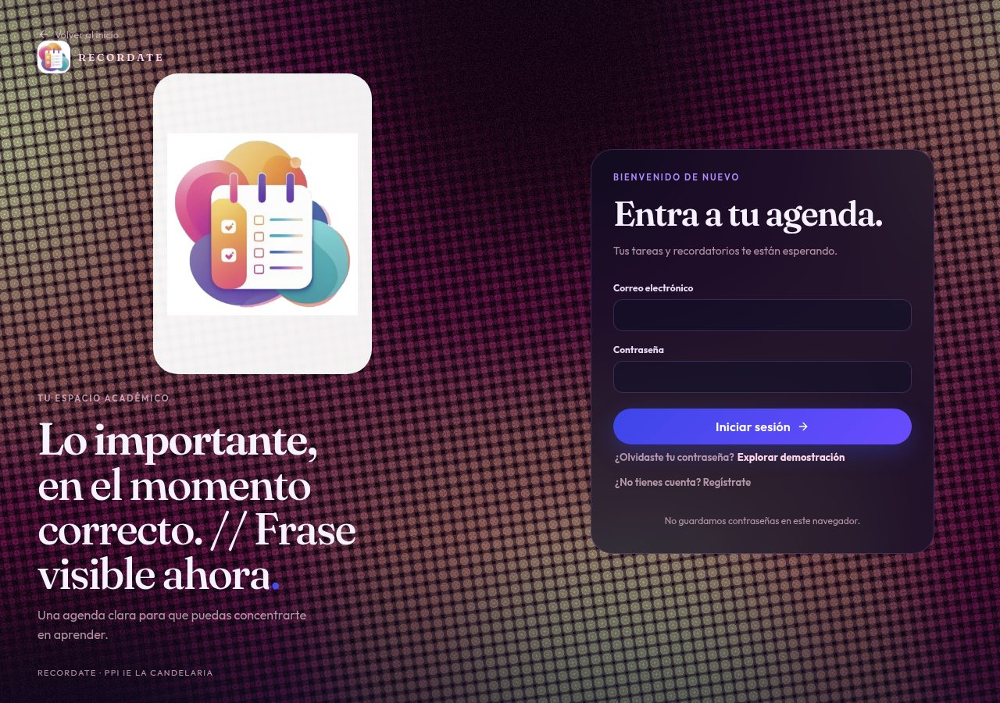
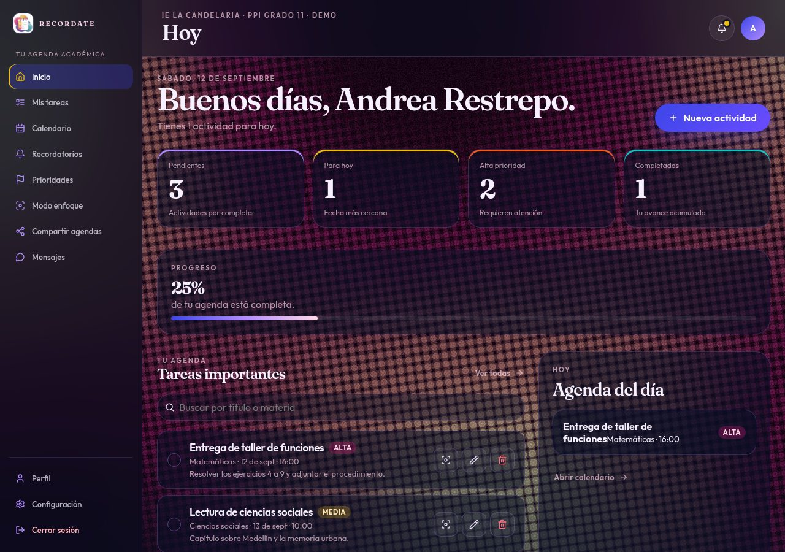

# Manual de usuario — RECORDATE

## Bienvenido a RECORDATE

RECORDATE es la agenda académica del Proyecto Pedagógico Integrador (PPI) de grado 11 de la IE La Candelaria, Medellín. Sirve para organizar tareas, trabajos, entregas y recordatorios en un solo lugar, desde el celular o el computador.

Este manual explica **cómo usar la página publicada**, no cómo programarla.

**Dirección de la aplicación:** [https://johanxinho.github.io/PRYECTO-PPI/](https://johanxinho.github.io/PRYECTO-PPI/)

**Código del proyecto:** [https://github.com/johanxinho/PRYECTO-PPI](https://github.com/johanxinho/PRYECTO-PPI)

---

## Capturas de la versión publicada

### Portada

Al abrir el enlace ves la portada: logo, menú de anclas, botón **Iniciar sesión**, el título *Tu día académico* con palabras que cambian (Recuerda, Organiza, Prioriza, Avanza) y la animación *Electric Gaze* a la derecha.

### Portada en celular

En el teléfono la misma portada se adapta; el menú y los botones siguen disponibles.

### Pantalla de acceso

Desde **Iniciar sesión** o **Comenzar ahora** entras al panel de acceso: correo, contraseña, recuperación, registro y la opción **Explorar demostración**.

### Panel (modo demostración)

En la demostración entras como *Andrea Restrepo* con tareas de ejemplo: menú lateral, resumen del día, progreso y lista de actividades.

---

## 1. ¿Qué puedes hacer?

- Ver la portada del proyecto y conocer RECORDATE antes de entrar.
- Crear una cuenta real (se guarda en la nube con Supabase) o explorar una **demostración local**.
- Registrar, editar, completar y eliminar tareas académicas.
- Buscar y filtrar por título, materia, prioridad, estado o fecha.
- Revisar la agenda en calendario.
- Activar recordatorios y alarmas mientras la página está abierta.
- Trabajar en **modo enfoque** (una sola tarea en pantalla).
- Compartir actividades con compañeros registrados.
- Enviar mensajes internos.
- Adjuntar una imagen a una tarea (máximo 5 MB, solo en cuenta real).
- Ajustar perfil, notificaciones del navegador y preferencias.

---

## 2. Requisitos

- Un navegador actualizado: Chrome, Edge, Firefox o Safari.
- Conexión a internet.
- Para guardar la agenda en la nube: una cuenta con correo y contraseña.
- Para avisos del navegador: aceptar el permiso de notificaciones cuando RECORDATE lo pida.

La página funciona en computador y en celular. En el teléfono el menú aparece abajo, pensado para usarlo con una mano.

---

## 3. Cómo abrir la página

1. Abre el navegador.
2. Entra a [https://johanxinho.github.io/PRYECTO-PPI/](https://johanxinho.github.io/PRYECTO-PPI/).
3. Espera a que cargue la **portada** (fondo oscuro, logo del calendario y el retrato animado a la derecha).
4. Desde ahí puedes leer el proyecto, iniciar sesión o entrar a la demostración.

Si la dirección no abre, recarga o prueba otro navegador. El enlace debe incluir `/PRYECTO-PPI/` al final.

---

## 4. La portada (antes de iniciar sesión)

Al abrir RECORDATE ves la landing. No necesitas cuenta para leerla.

**Arriba**
- Logo RECORDATE (calendario con checklist).
- Enlaces: Características, Cómo funciona, Beneficios, Preguntas.
- Botón **Iniciar sesión**.

**Hero (bloque principal)**
- El título fijo *Tu día académico.*
- Palabras que van cambiando: Recuerda, Organiza, Prioriza, Avanza.
- Texto de presentación del PPI.
- Botón **Comenzar ahora**: abre la pantalla de acceso.
- **Conocer más**: baja a la explicación del problema.
- A la derecha, la animación **Electric Gaze** (retrato en puntos ASCII). Es visual; no se toca ni se configura.

**Más abajo**
- El reto académico que resuelve RECORDATE.
- Seis características numeradas (tareas, recordatorios, enfoque, equipo, búsqueda, avance).
- Beneficios y el botón **Abrir RECORDATE**.
- Preguntas frecuentes.
- Pie de página con la marca y el crédito del PPI.

Toda esa portada es informativa. Para usar la agenda pulsa **Comenzar ahora**, **Iniciar sesión** o **Abrir RECORDATE**.

---

## 5. Crear una cuenta (nube)

Sirve para guardar tus tareas en Supabase y recuperarlas en otro dispositivo.

1. En la portada pulsa **Comenzar ahora** o **Iniciar sesión**.
2. En el formulario pulsa **¿No tienes cuenta? Regístrate**.
3. Escribe tu nombre completo.
4. Escribe un correo válido.
5. Crea una contraseña de **mínimo 6 caracteres** y confírmala.
6. Pulsa **Crear mi cuenta**.
7. Si pide verificación, revisa el correo (y la carpeta de spam) y escribe el **código de 6 dígitos**.
8. Si no llega, usa **Reenviar código**. El código caduca; pide uno nuevo si hace falta.

Al verificar, entras al panel. En otro dispositivo inicia sesión con el mismo correo.

### Mensajes que puedes ver al registrarte

| Situación | Qué significa |
| --- | --- |
| Correo ya registrado | Usa **Inicia sesión** o otro correo. |
| Correo inválido | Revisa que tenga forma `nombre@dominio.com`. |
| Contraseña corta | Usa al menos 6 caracteres. |
| Límite de intentos | Espera unos minutos y vuelve a intentar. |
| No conecta | Revisa tu internet e inténtalo de nuevo. |

---

## 6. Iniciar sesión

1. En la portada pulsa **Iniciar sesión**.
2. Escribe correo y contraseña.
3. Pulsa **Iniciar sesión**.

Si los datos son correctos se abre el panel (Inicio). La sesión se mantiene al recargar, hasta que cierres sesión.

Si aún no confirmaste el correo, RECORDATE te pedirá verificarlo antes de entrar.

---

## 7. Explorar la demostración (sin cuenta)

En la pantalla de acceso está **Explorar demostración**.

- Entras como *Andrea Restrepo* con tareas de ejemplo.
- Los datos viven **solo en este navegador** (no se suben a la nube).
- No hay adjuntos ni notificaciones push en este modo.
- Puedes crear, editar y completar tareas para entender el flujo.
- Al borrar los datos del sitio o cambiar de dispositivo, la demo se reinicia.

Para un trabajo real del colegio usa una **cuenta con correo**, no la demostración.

---

## 8. Recuperar la contraseña

Solo aplica a cuentas reales, no a la demo.

1. En el acceso pulsa **¿Olvidaste tu contraseña?**.
2. Escribe tu correo y pulsa **Enviar enlace**.
3. Abre el correo (revisa spam) y sigue el enlace. En GitHub Pages el enlace vuelve a `/PRYECTO-PPI/reset-password`.
4. Escribe una contraseña nueva (mínimo 6 caracteres) y confírmala.
5. Pulsa **Actualizar contraseña** y vuelve a entrar.

Por seguridad, el mensaje de envío no confirma si el correo existe o no: si está registrado, recibirás el enlace.

---

## 9. El panel principal

Después de entrar ves el escritorio oscuro de RECORDATE, con tarjetas semitransparentes.

**Menú (computador: columna izquierda; celular: barra inferior)**

| Sección | Para qué sirve |
| --- | --- |
| Inicio | Resumen del día, saludo y métricas |
| Mis tareas | Lista completa, búsqueda, filtros y alta de actividades |
| Calendario | Mes con las tareas por día |
| Recordatorios | Actividades con aviso configurado |
| Prioridades | Agrupadas en Alta, Media y Baja |
| Modo enfoque | Una sola tarea a pantalla completa |
| Compartir agendas | Enviar una tarea a un compañero por correo |
| Mensajes | Chat interno entre usuarios registrados |
| Perfil | Nombre, correo y preferencias |
| Configuración | Los mismos ajustes de perfil y cierre de sesión |

Arriba a la derecha: campana de notificaciones internas, acceso a perfil y **cerrar sesión**. En celular, el botón de menú abre el resto de secciones.

---

## 10. Crear una tarea

1. Entra a **Mis tareas** (o usa **+ Nueva actividad** desde Inicio).
2. Pulsa el botón para crear.
3. Completa:
   - **Título** (obligatorio)
   - **Materia** (obligatorio)
   - **Fecha** (obligatorio)
   - **Hora** (obligatorio)
   - **Prioridad:** Alta, Media o Baja
   - **Recordatorio:** al momento, minutos u horas antes, o 1 día antes
   - **Descripción** (opcional)
   - **Adjuntar imagen** (opcional, solo cuentas reales, máximo 5 MB)
4. Pulsa **Crear tarea**.

Si falta título, materia, fecha u hora, RECORDATE no guarda y muestra el aviso.

Puedes cerrar el formulario con **Escape** o haciendo clic fuera del cuadro.

### Consejos
- Título concreto: *Taller 3 de trigonometría*, no *tarea*.
- La fecha y la hora son las de la entrega o el evento.
- Prioridad Alta para lo que no puede esperar.

---

## 11. Editar, completar y eliminar

En cada tarjeta de tarea puedes:

- **Completar / desmarcar:** el círculo a la izquierda.
- **Editar** (lápiz): cambia fecha, hora, texto o prioridad y guarda.
- **Eliminar** (papelera): quita la tarea. Pide confirmación si el flujo lo muestra.
- **Modo enfoque** (icono de diana): abre esa actividad a pantalla completa.
- **Ver imagen:** si hay adjunto, la abre en otra pestaña. El dueño puede quitarla con la X.

Solo el dueño edita, completa o borra. Una tarea compartida se ve, pero no se administra.

---

## 12. Buscar y filtrar

En **Mis tareas**:

**Buscar** por título, materia o descripción.

**Filtrar** por:

- Prioridad (Alta, Media, Baja)
- Estado (pendiente o completada)
- Fecha concreta

Combina búsqueda y filtros. Usa **Limpiar filtros** para volver a la lista completa. Si no hay resultados, verás un estado vacío con la opción de crear una actividad.

En **Perfil** puedes ocultar las tareas ya completadas si no quieres verlas.

---

## 13. Calendario

- Mes actual con las actividades en su día.
- Flechas para cambiar de mes.
- Al tocar un día o una tarea, vas al detalle o a la lista.

Sirve para ver entregas de un vistazo, no para crear eventos sueltos: las actividades se crean en **Mis tareas**.

---

## 14. Recordatorios, alarmas y notificaciones

Al crear o editar una tarea eliges cuándo avisar.

**Dentro de RECORDATE (página abierta)**
- La sección **Recordatorios** lista lo que tiene aviso.
- Si las **alarmas** están activas en Perfil, suena y se muestra el aviso a la hora calculada.
- Puedes cerrar la alarma con **Escape**.

**Notificaciones del navegador**
1. En Perfil o Configuración activa las notificaciones del navegador.
2. Acepta el permiso cuando el navegador lo pida.
3. Verás avisos aunque cambies de pestaña, mientras el sitio siga abierto.

La campana del encabezado muestra avisos internos: tareas, mensajes y agendas compartidas. Puedes marcar uno o todos como leídos.

> Las notificaciones con la aplicación **totalmente cerrada** (Web Push) están preparadas, pero dependen de un envío externo que este proyecto no incluye. Los recordatorios útiles del PPI son los de la página abierta y el permiso del navegador.

---

## 15. Modo enfoque

Para trabajar sin el resto de la lista:

1. Elige una tarea y pulsa el icono de enfoque, o entra a **Modo enfoque** y selecciona.
2. Ves título, materia, hora y descripción al frente.
3. Puedes marcarla como completada (si eres el dueño) o salir del modo enfoque.
4. **Escape** también cierra el modo enfoque.

---

## 16. Compartir agendas

Para que un compañero **con cuenta en RECORDATE** vea una de tus tareas:

1. Entra a **Compartir agendas**.
2. Escribe el correo con el que se registró (debe ser un correo válido).
3. Elige la actividad (debe estar pendiente).
4. Guarda. El otro la verá en su lista (sin poder editarla ni borrarla).
5. Cuando ya no haga falta, **revoca** el acceso desde la misma sección.

En la demostración el compartido es local y de prueba; en cuenta real usa el correo exacto del compañero.

---

## 17. Mensajes

1. Abre **Mensajes**.
2. Busca al usuario por correo (válido).
3. Escribe y envía.
4. Lee la conversación en el mismo panel.

Solo hay chat entre cuentas registradas. La demo simula un compañero local; no llega a otra persona.

---

## 18. Perfil y configuración

Ahí puedes:

- Ver nombre, correo y rol (Estudiante, Docente o Administración).
- Activar o desactivar **recordatorios**.
- Activar o desactivar **alarmas**.
- Activar o desactivar **notificaciones del navegador**.
- Mostrar u ocultar **tareas completadas**.
- **Cerrar sesión**.

Cerrar sesión te devuelve a la portada. En la demo también sale del usuario de ejemplo.

---

## 19. Cómo se ve RECORDATE

La versión publicada usa una identidad oscura:

- Fondo navy con textura en movimiento.
- Tarjetas de vidrio (texto sobre cristal).
- Logo oficial: calendario con checklist.
- En la portada, animación ASCII del retrato *Electric Gaze*.

No hay que configurar el aspecto. Si el movimiento molesta, el sistema de **reducir movimiento** del dispositivo baja o congela esas animaciones.

---

## 20. Recomendaciones

- Entra siempre por el enlace de GitHub Pages indicado arriba.
- Usa cuenta real para el trabajo del colegio; la demo es solo para probar.
- Títulos claros y prioridad Alta para lo urgente.
- Revisa el calendario al empezar el día.
- Activa recordatorios en las entregas importantes y deja RECORDATE abierto cerca de la hora.
- Adjunta capturas o fotos del taller cuando ayuden; no subas archivos de más de 5 MB.
- Cierra sesión en computadores compartidos.

---

## 21. Problemas frecuentes

### La página no abre o se ve en blanco
- Comprueba la URL completa: `https://johanxinho.github.io/PRYECTO-PPI/`.
- Recarga. Prueba otro navegador o datos móviles.

### No puedo iniciar sesión
- Correo y contraseña exactos.
- Si acabas de registrarte, verifica el código de 6 dígitos.
- Si el mensaje dice que debes confirmar el correo, revisa tu bandeja y spam.
- Usa **¿Olvidaste tu contraseña?** en cuentas reales.

### No llega el código o el correo de recuperación
- Revisa spam.
- Pulsa **Reenviar código**.
- Confirma que el correo esté bien escrito.
- Si pediste demasiados correos seguidos, espera unos minutos.

### No puedo crear o ver tareas
- Debes haber iniciado sesión (cuenta o demo).
- Completa título, materia, fecha y hora.
- Si usas cuenta real y sigue fallando, avisa al docente o al administrador.

### La imagen no se adjunta
- Solo en cuenta real, no en la demo.
- Formato de imagen y **máximo 5 MB**.

### No suenan recordatorios
- Activa recordatorios y alarmas en Perfil.
- Deja la pestaña abierta a la hora del aviso.
- Acepta notificaciones del navegador si las quieres fuera de la pestaña.

### No puedo compartir
- El correo debe ser de alguien ya registrado.
- La tarea debe estar pendiente.
- En la demo el compartido no llega a otra persona.

### En el celular no veo todas las secciones
- Usa la barra inferior y el botón de menú para Perfil y Configuración.

---

## 22. Preguntas frecuentes

**¿Tengo que crear cuenta?**  
Para guardar en la nube, sí. Para conocer la interfaz puedes usar **Explorar demostración**.

**¿Funciona en el celular?**  
Sí. El menú se adapta a iPhone y Android.

**¿Puedo cambiar fecha u hora después?**  
Sí, con **Editar** en la tarjeta.

**¿Puedo borrar una tarea?**  
Sí, si eres el dueño.

**¿Qué pasa si no quiero avisos?**  
Desactívalos en Perfil.

**¿La animación de la portada es una función?**  
No. Es parte de la identidad visual. La agenda se usa desde el panel, después de entrar.

**¿Dónde está publicada?**  
En GitHub Pages: [https://johanxinho.github.io/PRYECTO-PPI/](https://johanxinho.github.io/PRYECTO-PPI/).

---

## 23. Soporte

- El administrador del sistema.
- El docente encargado del PPI.
- El equipo de RECORDATE.

Gracias por usar RECORDATE. El objetivo es que el día académico se vea claro: qué hay que hacer, cuándo y con qué prioridad.
